# LLM量子化 — 簡潔まとめ

## 1. 量子化とは

モデルの重みの数値精度を落とし、メモリ・計算コストを削減する技術。

$$\text{VRAM} = \frac{N \times b}{8} \text{ [bytes]}$$

| 形式 | ビット幅 | 値の数 | 7Bモデル VRAM | 品質 |
|------|---------|--------|---------------|------|
| FP32 | 32 | ~42億 | 28.0 GB | 基準 |
| FP16 | 16 | ~65,536 | 14.0 GB | ≈同等 |
| INT8 | 8 | 256 | 7.0 GB | 微減 |
| INT4 | 4 | 16 | 3.5 GB | 顕著に減 |

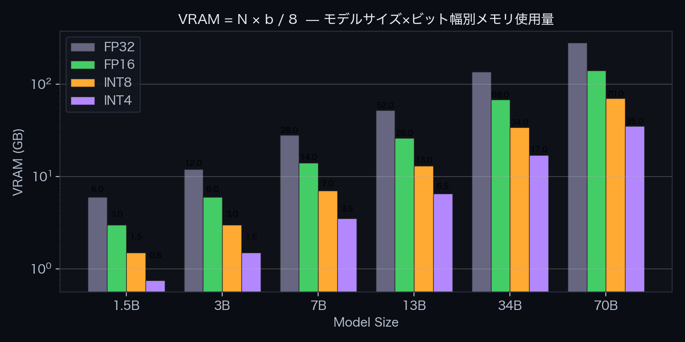

## 2. 量子化パイプライン

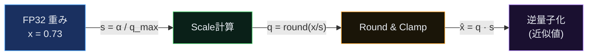

量子化誤差: $\varepsilon = |x - \hat{x}| \le s/2$

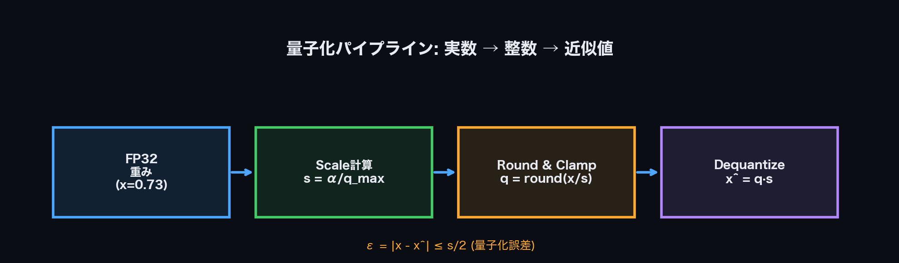

## 3. 3つの量子化方式

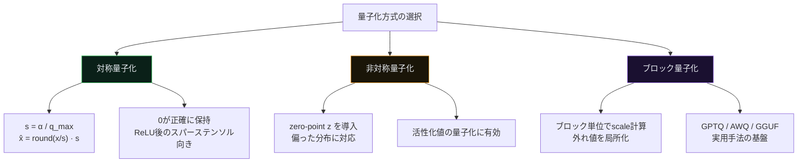

| 方式 | 特徴 | 用途 |
|------|------|------|
| 対称 | $s = \alpha / q_{\max}$, zero-point不要 | 重み (0中心分布) |
| 非対称 | zero-point $z$ でオフセット補正 | 活性化値 (偏った分布) |
| ブロック | ブロック毎に独立scale, $b_{\text{eff}} = b + 16/g$ | 実用 (GPTQ, AWQ等) |

## 4. 重み分布と量子化誤差

重みは正規分布 $w \sim \mathcal{N}(0, \sigma^2)$ に近く、95%以上が $\pm 3\sigma$ 内に集中。
これが量子化が成立する根本的理由。

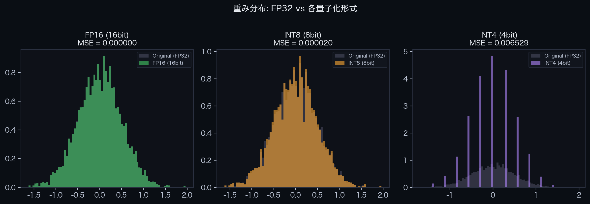

**SQNR (信号対量子化雑音比)**:  1bitあたり約6 dB。

$$\text{SQNR} \approx 6.02 \, b + C \;\text{[dB]}$$

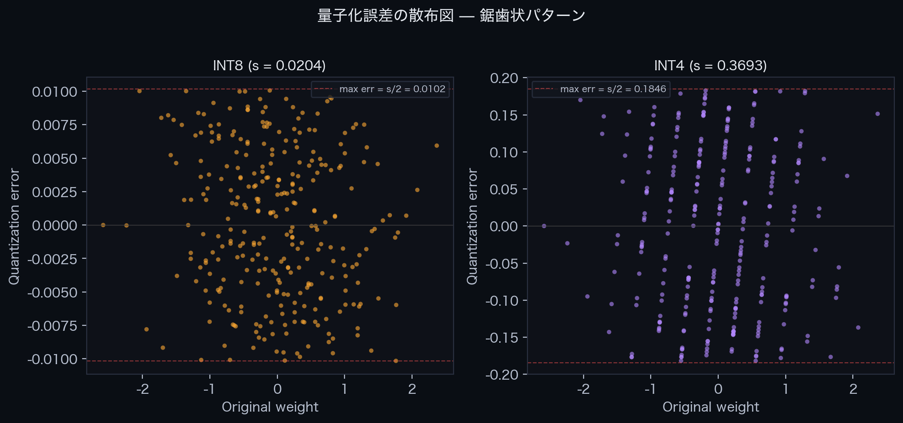

## 5. 実用手法の比較

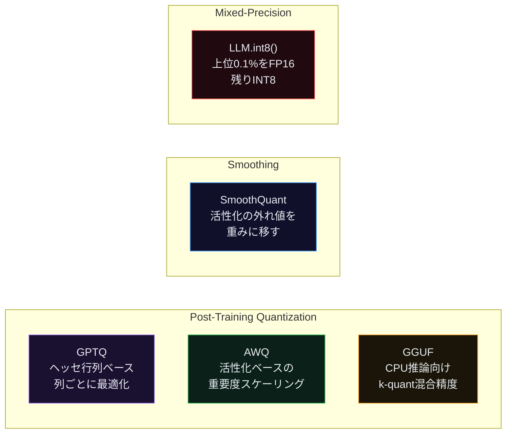

| 手法 | アプローチ | 特徴 |
|------|-----------|------|
| GPTQ | ヘッセ行列で誤差分散 | 高品質、GPU向け |
| AWQ | 活性化重要度でscale調整 | バランス良好 |
| GGUF | k-quant混合精度 | CPU推論、llama.cpp |
| SmoothQuant | 活性化→重みに外れ値移動 | W8A8で高速 |
| LLM.int8() | 混合精度 (FP16+INT8) | 外れ値チャネル保護 |

## 6. 外れ値問題

1個の外れ値 ($|\alpha_o| \gg |\alpha_n|$) がscaleを支配し、正常値の有効ビット幅が崩壊:

$$\text{有効bit} = b - 1 + \log_2\!\left(\frac{\alpha_n}{\alpha_o}\right)$$

$\alpha_o / \alpha_n = 100$ のとき、INT4の正常値は**実質情報量ゼロ**。

## 7. トレードオフの要点

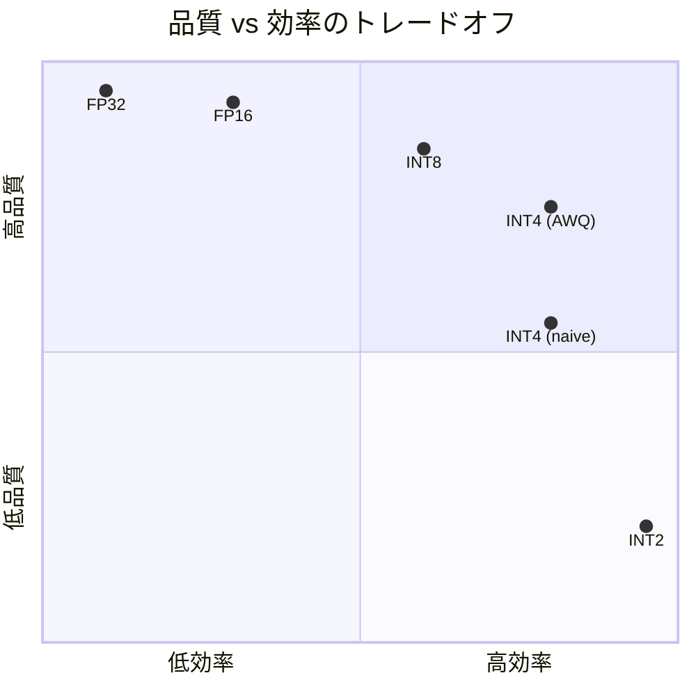

**実用ライン**: INT4 (AWQ/GPTQ) がギリギリ実用可能。INT2以下は品質崩壊。

---

## 付録: インタラクティブツールのスクリーンショット

| タブ | スクリーンショット |
|------|-------------------|
| なぜ量子化？ | 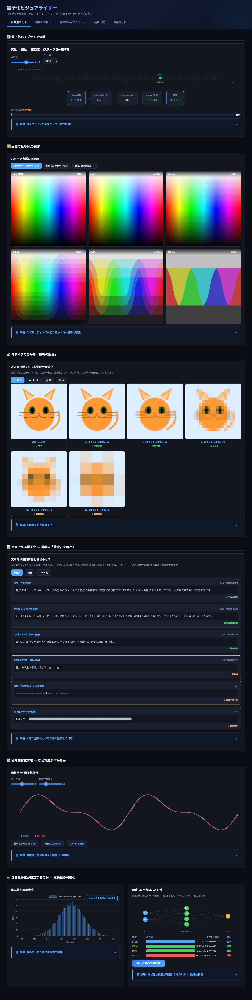 |
| 概要と可視化 | 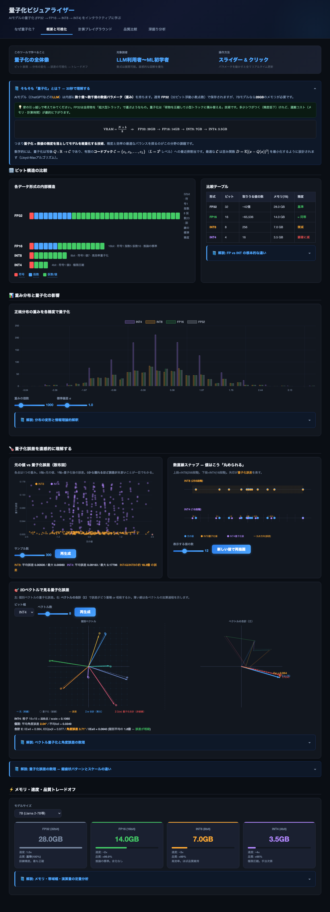 |
| 計算プレイグラウンド |  |
| 品質比較 | 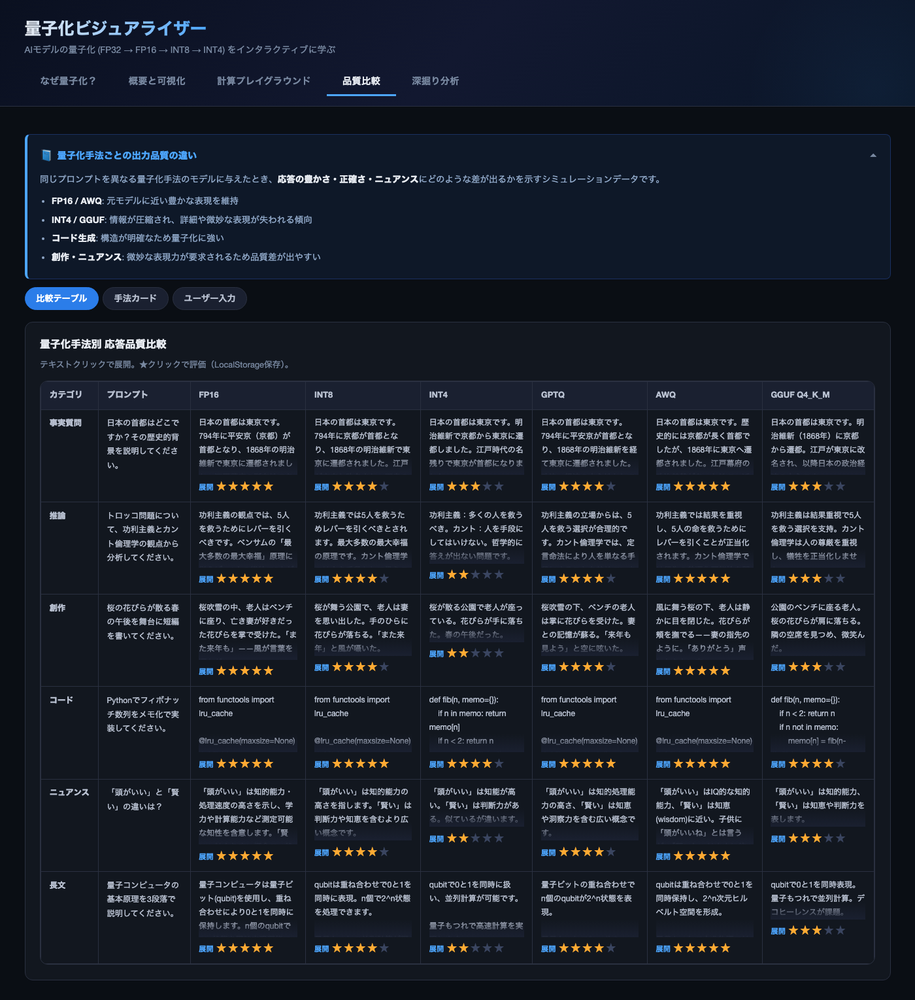 |
| 深掘り分析 | 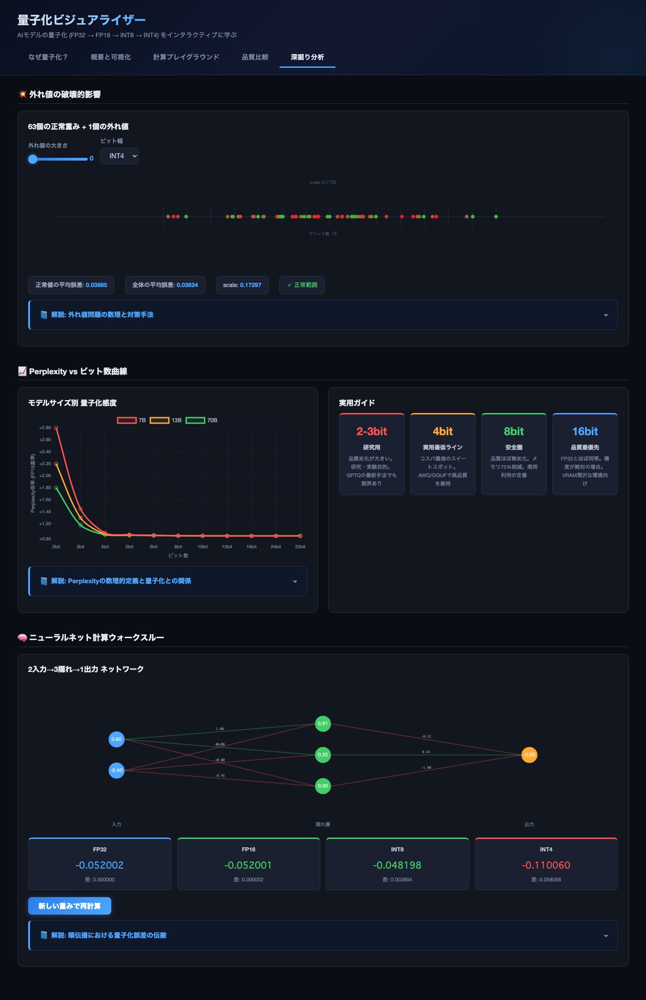 |
